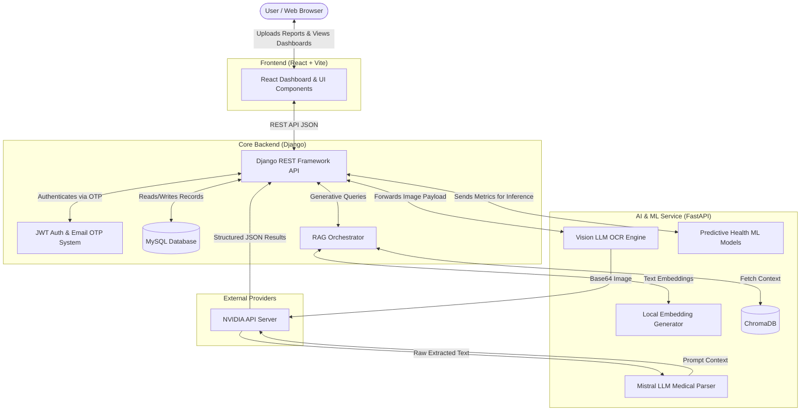
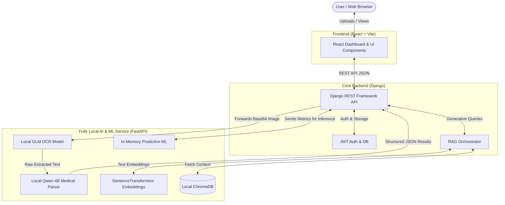

<div align="center">
  <h1 align="center">AI-Powered-Medical-Report-Analysis-and-Health-Risk-Prediction
</h1>
  <p align="center">
    <strong>An end-to-end GenAI application that extracts, visualizes, predicts, and explains your health data.</strong>
  </p>
  <p align="center">
    
    
    
    
    
  </p>
</div>

<hr/>

## Table of Contents
- [About the Project](#about-the-project)
- [Key Features](#key-features)
- [System Architecture](#system-architecture)
- [Directory Structure](#directory-structure)
- [Technology Stack](#technology-stack)
- [Installation & Setup](#installation--setup)
- [System Workflow](#system-workflow)
- [Core API Reference](#core-api-reference)

## About the Project
This project is a comprehensive health management and predictive diagnostic tool. By uploading standard medical blood test reports, the system leverages **Optical Character Recognition (OCR)** and **Large Language Models (LLMs)** to digitize and extract critical biomarkers. 

Furthermore, a Machine Learning inference pipeline runs underlying analytics to provide disease risk predictions, while a **Retrieval-Augmented Generation (RAG)** system serves as an AI medical assistant—offering personalized dietary advice, workout plans, and health summaries seamlessly.

## Key Features
- **Security First:** Robust JWT token-based authentication paired with Email OTP verification.
- **Automated Digitization:** Effortless OCR data extraction from uploaded medical images.
- **Interactive Dashboards:** Real-time data visualization plotting biometrics over time using Recharts.
- **Machine Learning Diagnostics:** Heart disease risk prediction based on tracked physiological data.
- **Context-Aware AI Assistant:** Ask questions about your health, diet, and fitness directly to your personalized LangChain & ChromaDB powered GenAI assistant.
- **Explainable AI (XAI):** Transparent AI explanations detailing exactly *why* a certain disease prediction risk was calculated.

---

## System Architecture
We adopted a robust, decoupled **microservices architecture**, containerized via Docker for maximum scalability.

1. **Client (React + Vite):** A rapid, Single Page Application offering smooth UX.
2. **Core Backend (Django + DRF):** The system's backbone handling business logic, authentication, database transactions, and dispatching RAG requests.
3. **AI/ML Service (FastAPI):** A high-performance, asynchronous service strictly delegated for intensive tasks like computer vision (OCR), embedding generation, and ML model inference.

### Visual Architecture Diagram



---

## AI & ML Architecture Details

### 1. High-Performance OCR via FastAPI
Instead of traditional OCR pipelines like Tesseract, the FastAPI service leverages **Vision Language Models (VLMs)** for superior text extraction from complex medical tables and handwritten OPD tickets.
- The user uploads an image, which is serialized (Base64) and sent to the FastAPI microservice.
- We utilize the **Llama-3.2-90B-Vision-Instruct** model (via NVIDIA API integration) to perform raw spatial text extraction, perfectly preserving the tabular layout of lab results and clinical vitals without relying on rigid bounding-box parsers.

### 2. Intelligent Data Extraction (LLM Parsing)
Once the raw text is acquired, it needs to be structured into a database-ready format.
- We use **Mistral-Large-3** integrated with **LangChain**.
- A strict prompt template coerces the LLM to act as a medical parser, outputting purely valid JSON format.
- It automatically categorizes information into `report_metadata` (lab details), `patient_information` (demographics), and `test_results` (test names, results, units, reference ranges). It also associates test results with their proper headings (e.g., "Lipid Profile - Total Cholesterol").

### 3. Local Model Architecture & Hybrid Deployment
The architecture is designed to support both cloud inference and fully local execution:
- **Local Vector Embeddings:** Text embeddings for the RAG architecture are computed completely locally using HuggingFace `SentenceTransformers` via the custom `embedd` module. This keeps the vectorization process fast, secure, and cost-free.
- **Predictive ML Execution:** The disease risk predictions utilize lightweight Machine Learning models loaded directly into FastAPI's memory via thread-safe singletons at startup, allowing for zero-latency local inference.
- **Switching Between Cloud and Local Extraction Models:** The system defaults to high-speed NVIDIA Cloud APIs for OCR and parsing, but the codebase includes built-in local wrappers (`ocr_Model` using GLM and `qwen_model` using Qwen-4B) designed to run extraction entirely on-device for strict data privacy and HIPAA compliance.

#### Offline Local AI Architecture Diagram
This diagram illustrates the flow when the system is switched to **Local Mode**, where zero data leaves the host machine:



#### How to Switch from Cloud API to Local Models in Code
To enable fully local, offline medical report processing, you simply need to modify the `util.py` file located in `Backend/FastAPI/`:

1. **Initialize Local Models:** Inside the `warm_up_ocr()` function, uncomment the local model loading logic:
   ```python
   _ocr_instance = ocr()
   _parser_instance = MedicalParser()
   ```

2. **Toggle the OCR Inference Engine:** Inside the `get_ocr_instance(image)` function, comment out the Cloud API call and uncomment the local GLM call:
   ```python
   # raw_result = extract_text_from_image(image) # Comment this out (Cloud)
   raw_result = _ocr_instance.excude_ocr(image)  # Uncomment this (Local)
   ```

3. **Toggle the LLM Parsing Engine:** In the same function, comment out the LangChain AI summary call and uncomment the local Qwen parsing call:
   ```python
   # result = AI_summary(raw_result)             # Comment this out (Cloud)
   result = _parser_instance.extract(raw_result) # Uncomment this (Local)
   ```

---

## Directory Structure
```text
.
├── Backend/                 # The Server Logic
│   ├── Django/              # Core API, Auth logic, RAG Pipelines
│   └── FastAPI/             # Async AI Service, OCR, Predictive ML
├── Frontend/                # The Client GUI (React SPA)
└── Website/                 # DevOps & Infrastructure Context
    ├── docker-compose.yml   # Multi-container orchestration
    └── *_env/               # Secure environment variables directory
```

---

## Technology Stack

| Domain | Technologies |
| :--- | :--- |
| **Frontend** | React 19, Vite, TailwindCSS, Recharts, React Router DOM |
| **Backend Core** | Django, Django REST Framework (DRF), SimpleJWT |
| **AI / ML Service** | FastAPI, Pandas, SentenceTransformers, PIL (Pillow) |
| **Generative AI** | LangChain, HuggingFace Transformers, OpenAI API |
| **Databases** | MySQL, ChromaDB (Vector Search Database) |
| **DevOps & Deploy** | Docker, Docker Compose, Gunicorn, Uvicorn |

---

## Installation & Setup 

### Option 1: Docker (Recommended)
You only need [Docker](https://docs.docker.com/get-docker/) & [Docker Compose](https://docs.docker.com/compose/) installed.

**1. Clone the repository**
```bash
git clone https://github.com/your-username/health-report-analysis.git
cd health-report-analysis
```

**2. Configure Environment Secrets**
Populate the empty `.env` files located inside `Website/Django_env/`, `Website/Fastapi_env/`, and `Website/React_env/`. Ensure you include:
- `OPENAI_API_KEY` or `HF_TOKEN`
- Database credentials & SMTP configurations.

**3. Build and Spin Up Services**
```bash
cd Website
docker-compose up --build
```
*Your frontend will be accessible at `http://localhost:5173`.*

### Option 2: Local Development
If you prefer running services outside containers, refer to individual READMEs or spawn instances independently:
- **Frontend:** run `npm run dev` in `/Frontend`
- **Django:** run `python manage.py runserver 8000` in `/Backend/Django`
- **FastAPI:** run `uvicorn main:app --port 8001` in `/Backend/FastAPI`

---

## System Workflow

1. **Authentication** -> User creates an account and verifies identity via Email OTP.
2. **Data Ingestion** -> User uploads visual medical reports. Django stores metadata and forwards the image to FastAPI.
3. **Smart Extraction** -> FastAPI's OCR pipeline identifies text and sanitizes medical markers, returning JSON coordinates to Django to append to the database.
4. **Insights Generation** -> The React dashboard fetches the historical health metrics and plots trends.
5. **Generative Assistance** -> Trigger custom insights (e.g., "Food", "Workout"). The data flows into the Vector Database, pulling context to generate actionable plans.
6. **Risk Assessment** -> Run a snapshot risk check. ML logic infers predictability while LLM generates the "Explainable AI" context so standard users understand their metrics.

---

## Core API Reference

| Service | Endpoint | Method | Purpose |
| :--- | :--- | :--- | :--- |
| **Auth** | `/api/signup/` | `POST` | Account creation & OTP dispatch |
| **Auth** | `/api/verify-otp/` | `POST` | Exchange OTP for JWT Token |
| **Data** | `/api/upload-medical-report/` | `POST` | Multi-image file parsing & OCR proxy |
| **Data** | `/api/dashboard-data/` | `GET` | Retrieve structured timeseries records |
| **AI** | `/api/reports/report-ai-insights/` | `POST/GET` | Compute & cache RAG medical insight context |
| **ML** | `/api/detection/analyze/` | `POST` | Proxy inference metrics into FastAPIs engine |

---

<div align="center">
  <i>Developed to enhance preventative health practices through Artificial Intelligence and Data Analytics.</i>
</div>
